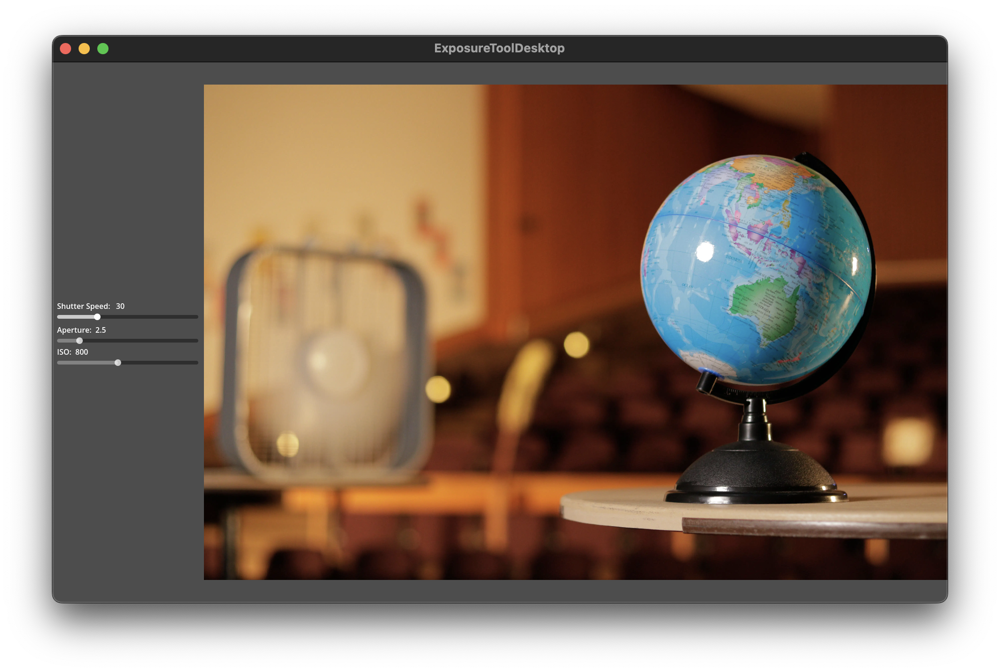

Exposure Tool
=============

This is a simple desktop application to preview different exposure settings
quickly. I built it to use in a classroom setting. Now with updated images with
consistent lighting. Great for educating people about the exposure triangle!

